<h1 align="center">Hi 👋, I'm Sayad Golam Morshed</h1>
<h3 align="center">A passionate frontend developer from Bangladesh</h3>

  

- 🔭 I’m currently working on [EcoBazar](https://github.com/GM-22/EcoBazar)

- 🌱 I’m currently learning **Backend Development - Node.js, Express.js, MongoDB**

- 👯 I’m looking to collaborate on [TourGuide](https://github.com/GM-22/TourGuide)

- 💬 Ask me about **React.js, Next.js**

- 📫 How to reach me **golammorshed0822@gmail.com**

<h1 align="left">Connect with me:</h1>

 
 
   
 
 
 

<h1 align="left">Languages and Tools:</h1>

> Tools and technologies that I work with and am interested in.

<table>
  <tr>
    <td align="center">
       
      <b>Next.js</b>
    </td>
   <td align="center" >
       
      <b>React.js</b>
    </td>
    <td align="center">
       
      <b>Redux</b>
    </td>
   <td align="center">
   
  <b>REST API</b>
</td>
    <td align="center" >
       
      <b>JavaScripts</b>
    </td>
    <td align="center">
       
      <b>Tailwind CSS</b>
    </td>
    <td align="center">
       
      <b>Bootstrap</b>
    </td>
       <td align="center">
       
      <b>CSS</b>
    </td>
   <td align="center">
       
      <b>HTML5</b>
    </td>
  
  </tr>

  <tr>
 <td align="center">
   
  <b>Firebase</b>
</td>
     <td align="center">
       
      <b>Figma</b>
    </td>
   <td align="center">
   
  <b>C++</b>
</td>

<td align="center">
   
  <b>Python</b>
</td>

<td align="center">
   
  <b>Django</b>
</td>
    <td align="center">
       
      <b>Git</b>
    </td>
    <td align="center">
       
      <b>GitHub</b>
    </td>
    <td align="center">
       
      <b>VS Code</b>
    </td>
   
  </tr>
</table>

  
  

 

